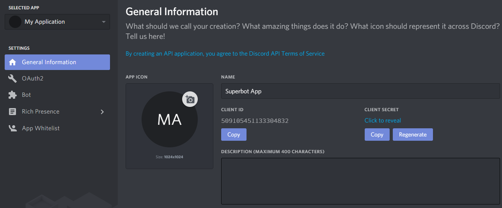

# PokeAssistant
A bot to help you with catching Pokemons on Pokecord.
## Information
PokeAssistant is a bot aimed to help Pokecord players. It will tell you what Pokemon it is whenever Pokecord spawns one. As such, you no longer have to rack your brains or even search Google. Sometimes, you may just miss a rare Pokemon like this.
### Developer
@CHamburr#2591
### How does it work?
All the images from Pokecord are hashed into short strings, and stored in our database. When Pokecord spawns a Pokemon, PokeAssistant will hash it, then compare with the database and retrieve the name of the Pokemon.
### Bot is blacklisted?
Don't worry, creating bots is easy. Join our official server to invite a new bot, and always get the latest announcements.
### You're miles, or a moderator from Pokecord?
Impressed with my bot? 100% accuracy. Come drop me a DM.
### Want to help?
I'm glad you would like to help! There are two ways you can do so.
Firstly, share it. This is extremely important for the bot to grow.
And secondly, support me financially. Look at your PayPal/bank balance/anything, do you have that $1 to spare for me? Yes, even $1 helps. And of course, the more, the better. If you're interested, please drop me a DM. 
Here are some perks you can get:
- Private bot for your server
- Premium on another bot
- Priority for feature requests
### Bot invite link
https://discordapp.com/oauth2/authorize?client_id=556637640036843520&scope=bot&permissions=8
### Server invite link
https://discord.gg/TYe3U4w

## Self-hosting Guide
You surely want a private bot for your server, now that you have got the source code, you wonder: how do I keep the bot up 24/7?
So here the guide exists to teach you how.
### Step 1: Creating a bot account
The first step in creating a bot is to create your own Discord application. The bot will use the Discord API, which requires the creation of an account for authentication purposes. Don't worry though, it's super simple.
#### Creating the application
To create the application, head to https://discordapp.com/developers/applications/. Log in, and you'll reach a page that looks like this:

Click on **Create an application**. This brings you to the following page, in which you should simply enter a name for the application. After clicking **Create**, you can also add an avatar. Click **Save Changes** afterwards.

#### Creating the bot account
After creating the application, we need to create the Bot User. Go to the Bot section on the left, then click on **Add Bot**, then **Yes, Do it**.

There's a few things you can change here. 
- Username: change your bot's username on Discord
- Icon: change the bot's avatar
- Public bot: toggles the ability for other users to add your bot to their server.
- Require Oauth2 Code Grant: don't check this. Just, don't.
####
