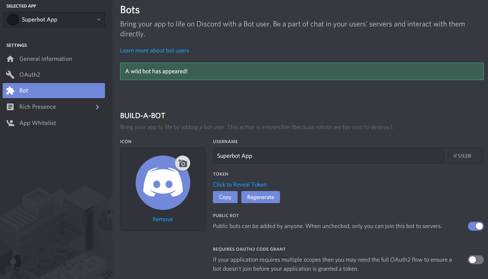

# PokeAssistant
A bot to help you with catching Pokemons on Pokecord.
## Information
PokeAssistant is a bot aimed to help Pokecord players. It will tell you what Pokemon it is whenever Pokecord spawns one. As such, you no longer have to rack your brains or even search Google. Sometimes, you may just miss a rare Pokemon like this.
### Developer
CHamburr#2591
### How does it work?
All the images from Pokecord are hashed into short strings, and stored in our database. When Pokecord spawns a Pokemon, PokeAssistant will hash it, then compare with the database and retrieve the name of the Pokemon.
### Bot is blacklisted?
Don't worry, creating bots is easy. Join our official server to invite a new bot, and always get the latest announcements.
### You're miles, or a moderator from Pokecord?
Impressed with my bot? 100% accuracy. Come drop me a DM.
### Want to help?
I'm glad you would like to help! There are two ways you can do so.
Firstly, share it. This is extremely important for the bot to grow.
And secondly, support me financially. Look at your PayPal/bank balance/anything, do you have that $1 to spare for me? Yes, even $1 helps. And of course, the more, the better. If you're interested, please drop me a DM. 
Here are some perks you can get:
- Private bot for your server
- Premium on another bot
- Priority for feature requests
### Bot invite link
https://discordapp.com/oauth2/authorize?client_id=556637640036843520&scope=bot&permissions=8
### Server invite link
https://discord.gg/TYe3U4w

## Self-hosting Guide
You surely want a private bot for your server, now that you have got the source code, you wonder: how do I keep the bot up 24/7?
So here the guide exists to teach you how.
### Step 1: Creating a bot account
The first step in creating a bot is to create your own Discord application. The bot will use the Discord API, which requires the creation of an account for authentication purposes. Don't worry though, it's super simple.
#### Creating the application
To create the application, head to https://discordapp.com/developers/applications/. Log in, and you'll reach a page that looks like this:


Click on **Create an application**. This brings you to the following page, in which you should simply enter a name for the application. After clicking **Create**, you can also add an avatar. Click **Save Changes** afterwards.


#### Creating the bot account
After creating the application, we need to create the Bot User. Go to the Bot section on the left, then click on **Add Bot**, then **Yes, Do it**.



There's a few things you can change here. 
- Username: Change your bot's username on Discord
- Icon: Change the bot's avatar
- Public bot: Toggles the ability for other users to add your bot to their server.
- Require Oauth2 Code Grant: Don't check this. Just, don't.
#### Adding to your server
To generate the invite link, click on **Oauth2** in the app page, and scroll down to **Scopes**. Check the **Bot** scope to generate a link. You can also add additional permissions for the bot.


Copy the link and open it, select your server and click on **Authorize**. Cheers, it has been added to your server.
#### Getting the token
Go to the **Bot** page and copy the token. Save it somewhere, you will need that later.


Source: https://anidiots.guide/getting-started/getting-started-long-version
### Step 2: Hosting the bot
The bot will be hosted on Glitch, so you need to create a Glitch account first: https://glitch.com/.
#### Getting the code
The code has already been setup, you only need to go to https://glitch.com/edit/#!/pokeassistant, click **pokeassistant** on the top left hand corner, then **Remix Project**. Be sure to login first, if not, the project will be deleted after a few days.


#### Configuration
Go to .env file. All options are compulsory.
- TOKEN: Put in the one you copied just now
- OWNER: Your ID, for multiple owners separate with `,` (no spacing)
- EVENTCHANNEL: ID of channel where the event logs go to
- ERRORCHANNEL: ID of channel where the error logs go to
- JOINLEAVECHANNEL: ID of channel where the join and leave logs for the bot go to

An example would be:
```
TOKEN=NTU2NjQ2MjA1MDExMDAxMzQ1.D29B7Q.LcTk_nSujMXdVyFohpJpjF50odE
OWNER=446290930723717120,458932042252419072
EVENTCHANNEL=512601541341872129
ERRORCHANNEL=512601576448327680
JOINLEAVECHANNEL=511781018559315978
```
The file is automatically saved. But to refresh, you need to delete watch.json.


The bot should be online now.

### Step 3: Keeping the bot online (Optional)
Glitch shuts down projects that are inactive for over 5 minutes. The current code should already keep it up, but some users feedback that it doesn't. We will be using Uptime Robot to keep it up here. Create an account first: https://uptimerobot.com/signUp.

After signing up, login and go to the Dashboard, click on **Create New Monitor**, the configurations are as follows:


- Monitor Type: Choose HTTP(s)
- Friendly Name: Literally anything
- URL (or IP): Put `https://projectname.glitch.me`. Replace projectname with whatever your project's name is. You can get it by going to https://glitch.com. Under **Your Projects**, you should see the name of your project and the description. In my case it is `pokeassistant`.


- Monitoring Interval: 5 minutes

Finally click **Create Monitor**. And you're done! Done with everything!

## Additional Help
You can get more help by joining our server https://discord.gg/TYe3U4w or DM CHamburr#2591.

### Made by CHamburr#2591
